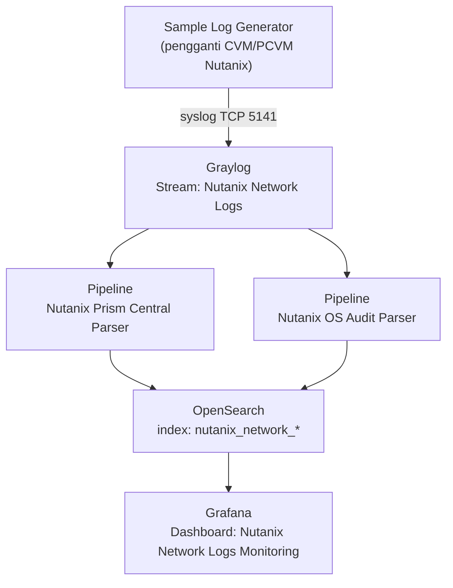

# Nutanix SOC Sandbox

Integrasi Log Prism Central menuju Graylog, OpenSearch, dan Grafana.

Lingkungan sandbox untuk mempelajari dan mendemonstrasikan integrasi log **Nutanix Prism Central** ke dalam tumpukan SIEM (Graylog, OpenSearch, dan Grafana). Proyek ini mencakup pipeline parsing, aturan deteksi, serta dashboard visualisasi.

> **Catatan penting:** Seluruh data, hostname, username, UUID, dan alamat IP pada sandbox ini bersifat **fiktif** dan dibuat khusus untuk keperluan pembelajaran. Tidak ada data produksi maupun data nyata di dalamnya. Kredensial yang tercantum hanya berlaku untuk sandbox lokal dan tidak boleh digunakan pada lingkungan nyata.

## Gambaran Alur yang Disimulasikan

Diagram berikut menggambarkan alur data ujung ke ujung yang direplikasi pada sandbox ini.



Tipe log yang dicakup (meniru format asli Prism Central):

| Tipe | Contoh | Aturan Terkait |
|------|--------|----------------|
| `api_audit` | pihak yang mengakses API atau UI, endpoint, dan method | Parse API Audit, Flag External, Flag Critical, Flag API Error |
| `cvm_audit` | auditd atau audispd internal CVM (su/sudo) | CVM Extract Fields, Drop Broken |
| `flow_service` | peristiwa microsegmentation atau IDF | Parse Flow Service Logs |
| `consolidated_audit` | audit terstruktur berformat JSON (login, logout, perubahan entity) | Parse Audit JSON |

## Struktur Folder

```
nutanix-soc-sandbox/
├── docker-compose.yml            # tumpukan lengkap (Graylog, OpenSearch, Grafana, Mongo)
├── README.md
├── VERSION                       # versi proyek
├── requirements.txt              # dependensi Python (seluruhnya pustaka standar)
├── .env.example                  # contoh variabel lingkungan untuk Docker
├── Makefile                      # perintah singkat untuk operasi umum
├── docs/
│   ├── ARCHITECTURE.md           # penjelasan arsitektur dan alur data
│   ├── SETUP.md                  # langkah pemasangan terperinci
│   ├── FIELD-REFERENCE.md        # daftar field hasil parsing
│   └── DETECTION-RULES.md        # kasus penggunaan keamanan per aturan dan gagasan alerting
├── graylog/
│   ├── inputs/                   # konfigurasi input Syslog TCP 5141
│   ├── rules/                    # 8 aturan pipeline (.grok)
│   ├── pipelines/                # 2 definisi pipeline
│   └── content-pack/             # content pack JSON (impor sekali klik)
├── grafana/
│   ├── datasources/              # provisioning datasource NUTANIX (OpenSearch)
│   └── dashboards/               # dashboard JSON (Terms dan Count, tanpa .keyword)
├── sample-data/
│   ├── sandbox_nutanix_logs.csv       # 2500 baris log sintetis (seluruh tipe)
│   └── sample_consolidated_audit.log  # contoh format consolidated_audit
└── scripts/
    ├── generate_sample_logs.py   # pembangkit data sandbox
    ├── feed_logs.py              # pengirim CSV ke Graylog syslog TCP
    ├── simulate_pipeline.py      # pemeriksa hasil parsing luring (tanpa Docker)
    └── validate.py               # uji mandiri validitas dan konsistensi proyek
```

## Validasi Cepat (Uji Mandiri)

Sebelum memulai, pastikan proyek dalam keadaan konsisten dengan menjalankan perintah berikut.

```bash
python3 scripts/validate.py
```

Perintah tersebut memeriksa validitas JSON dan YAML, konsistensi antara aturan dan pipeline, kecocokan regex dengan data contoh, serta referensi datasource. Kode keluaran nol menandakan seluruh pemeriksaan lolos.

## Cara Penggunaan

Tersedia dua jalur penggunaan, yaitu jalur cepat tanpa Docker dan jalur tumpukan penuh dengan Docker.

### Jalur A: Cepat Tanpa Docker (Memeriksa Logika Parsing)

Jalur ini hanya membutuhkan Python 3 dan tidak memerlukan Graylog maupun OpenSearch.

```bash
cd scripts
python3 simulate_pipeline.py --file ../sample-data/sandbox_nutanix_logs.csv
```

Keluaran berupa ringkasan tipe log, pengguna teratas, tipe klien, endpoint, dan tipe alert. Ringkasan tersebut merupakan hasil penerapan logika aturan terhadap data contoh sehingga bermanfaat untuk memahami keluaran setiap aturan.

Untuk membangkitkan ulang data dengan jumlah atau seed yang berbeda:

```bash
python3 generate_sample_logs.py --count 5000 --seed 7 --out ../sample-data/sandbox_nutanix_logs.csv
```

### Jalur B: Tumpukan Penuh (Docker)

Jalur ini membutuhkan Docker beserta Docker Compose dan RAM sekitar 4 GB.

```bash
# 1. Menjalankan tumpukan
docker compose up -d

# 2. Menunggu Graylog siap (sekitar 1 hingga 2 menit), lalu membuka http://localhost:9000 (admin/admin)

# 3. Mengimpor konfigurasi di antarmuka Graylog melalui dua opsi:
#    OPSI CEPAT (Content Pack):
#      System, lalu Content Packs, lalu Upload,
#      lalu pilih graylog/content-pack/nutanix-soc-content-pack.json,
#      lalu Install (seluruh 8 aturan dan 2 pipeline langsung terpasang)
#    OPSI MANUAL:
#      Input     : lihat graylog/inputs/nutanix-syslog-tcp-input.json
#      Rules     : salin dan tempel tiap berkas di graylog/rules/*.grok
#      Pipelines : buat 2 pipeline sesuai graylog/pipelines/*.pipeline
#    Setelah impor, hubungkan kedua pipeline ke stream Nutanix Network Logs

# 4. Mengirim log sandbox ke Graylog
cd scripts
python3 feed_logs.py --host localhost --port 5141 \
    --file ../sample-data/sandbox_nutanix_logs.csv --rate 30

# 5. Membuka Grafana di http://localhost:3000 (admin/admin)
#    Datasource NUTANIX dan dashboard telah ter-provisioning secara otomatis.
```

Untuk menyimulasikan aliran log secara langsung dan berkelanjutan, tambahkan opsi `--loop`.

```bash
python3 feed_logs.py --loop --rate 20
```

## Catatan Penting dari Sandbox Ini

Beberapa pelajaran penting yang perlu diperhatikan dirangkum sebagai berikut.

1. **Field bertipe teks tidak memiliki subfield `.keyword`.** Field hasil `set_field()` pada pipeline Graylog tersimpan di OpenSearch sebagai teks biasa. Pada Grafana, pengelompokan (Group By) harus menggunakan `nutanix_client_type` dan bukan `nutanix_client_type.keyword`. Subfield keyword tersebut tidak tersedia dan akan menyebabkan agregasi gagal.

2. **Pemecahan data (breakdown) pada panel Grafana** menggunakan metrik `Count` dipadukan dengan agregasi bucket `Terms` pada field kategori. Konfigurasi yang benar dapat dilihat pada berkas `grafana/dashboards/nutanix-monitoring-dashboard.json`.

3. **Format `api_audit` (key-value) lebih dominan** dibandingkan `consolidated_audit` (JSON). Keduanya disertakan dalam data contoh, dan aturan Parse Audit JSON menangani format JSON. Pada penerapan nyata, format JSON umumnya lebih jarang muncul sehingga aturan yang menganggur merupakan hal yang wajar.

4. **Operasi kritis relatif jarang** karena method GET lebih dominan. Sedikitnya jumlah POST, PUT, atau DELETE merupakan kondisi yang wajar pada lingkungan yang stabil dan bukan merupakan kesalahan.

Penjelasan lebih lanjut dapat dilihat pada folder `docs/`.

## Author

Dimasqi Ramadhani, Security Engineer

- [Portfolio](https://dimasqiramadhani.com)
- [GitHub](https://github.com/dimasqiramadhani)
- [Linkedin](https://linkedin.com/in/dimasqiramadhani)