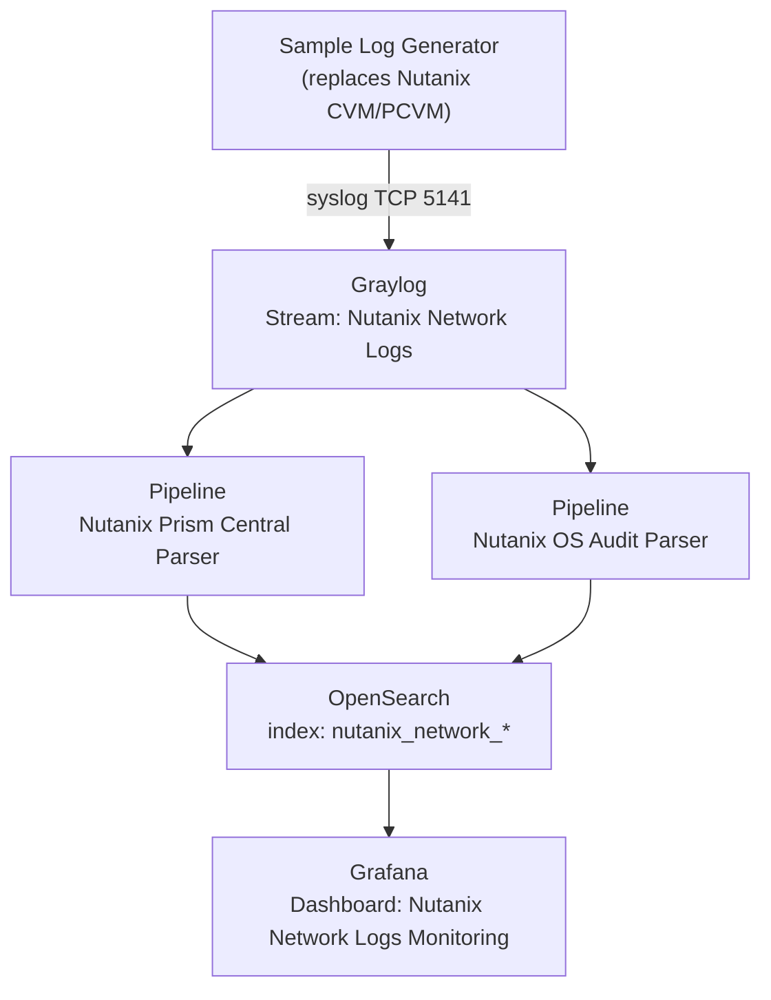

# Nutanix SOC Sandbox

Prism Central log integration into Graylog, OpenSearch, and Grafana.

A sandbox environment for learning and demonstrating how to integrate **Nutanix Prism Central** logs into a SIEM stack consisting of Graylog, OpenSearch, and Grafana. This project includes parsing pipelines, detection rules, and a visualization dashboard.

> **Important note:** All data, hostnames, usernames, UUIDs, and IP addresses in this sandbox are **fictional** and created solely for learning purposes. No production or real data is included. The credentials listed here apply only to a local sandbox and must never be used in a real environment.

## Simulated Flow Overview

The following diagram illustrates the end to end data flow replicated in this sandbox.



Log types covered (mirroring the real Prism Central format):

| Type | Example | Related Rules |
|------|---------|---------------|
| `api_audit` | who accesses the API or UI, endpoint, and method | Parse API Audit, Flag External, Flag Critical, Flag API Error |
| `cvm_audit` | CVM internal auditd or audispd (su/sudo) | CVM Extract Fields, Drop Broken |
| `flow_service` | microsegmentation or IDF events | Parse Flow Service Logs |
| `consolidated_audit` | structured JSON audit (login, logout, entity changes) | Parse Audit JSON |

## Folder Structure

```
nutanix-soc-sandbox/
├── docker-compose.yml            # full stack (Graylog, OpenSearch, Grafana, Mongo)
├── README.md
├── VERSION                       # project version
├── requirements.txt              # Python dependencies (all standard library)
├── .env.example                  # example environment variables for Docker
├── Makefile                      # shortcut commands for common operations
├── docs/
│   ├── ARCHITECTURE.md           # architecture and data flow explanation
│   ├── SETUP.md                  # detailed setup steps
│   ├── FIELD-REFERENCE.md        # list of parsed fields
│   └── DETECTION-RULES.md        # security use cases per rule and alerting ideas
├── graylog/
│   ├── inputs/                   # Syslog TCP 5141 input configuration
│   ├── rules/                    # 8 pipeline rules (.grok)
│   ├── pipelines/                # 2 pipeline definitions
│   └── content-pack/             # content pack JSON (one click import)
├── grafana/
│   ├── datasources/              # NUTANIX datasource provisioning (OpenSearch)
│   └── dashboards/               # dashboard JSON (Terms and Count, without .keyword)
├── sample-data/
│   ├── sandbox_nutanix_logs.csv       # 2500 lines of synthetic logs (all types)
│   └── sample_consolidated_audit.log  # consolidated_audit format example
└── scripts/
    ├── generate_sample_logs.py   # sandbox data generator
    ├── feed_logs.py              # sends CSV to Graylog syslog TCP
    ├── simulate_pipeline.py      # checks parsing results offline (without Docker)
    └── validate.py               # self test for project validity and consistency
```

## Quick Validation (Self Test)

Before starting, ensure the project is in a consistent state by running the following command.

```bash
python3 scripts/validate.py
```

This command checks JSON and YAML validity, consistency between rules and pipelines, regex matching against the sample data, and datasource references. An exit code of zero indicates that all checks passed.

## Usage

Two usage paths are available, namely a quick path without Docker and a full stack path with Docker.

### Path A: Quick Without Docker (Checking Parsing Logic)

This path requires only Python 3 and does not need Graylog or OpenSearch.

```bash
cd scripts
python3 simulate_pipeline.py --file ../sample-data/sandbox_nutanix_logs.csv
```

The output is a summary of log types, top users, client types, endpoints, and alert types. This summary results from applying the rule logic to the sample data, which helps you understand the output of each rule.

To regenerate the data with a different count or seed:

```bash
python3 generate_sample_logs.py --count 5000 --seed 7 --out ../sample-data/sandbox_nutanix_logs.csv
```

### Path B: Full Stack (Docker)

This path requires Docker with Docker Compose and approximately 4 GB of RAM.

```bash
# 1. Start the stack
docker compose up -d

# 2. Wait for Graylog to be ready (about 1 to 2 minutes), then open http://localhost:9000 (admin/admin)

# 3. Import the configuration in the Graylog interface using one of two options:
#    QUICK OPTION (Content Pack):
#      System, then Content Packs, then Upload,
#      then select graylog/content-pack/nutanix-soc-content-pack.json,
#      then Install (all 8 rules and 2 pipelines are installed at once)
#    MANUAL OPTION:
#      Input     : see graylog/inputs/nutanix-syslog-tcp-input.json
#      Rules     : copy and paste each file in graylog/rules/*.grok
#      Pipelines : create 2 pipelines according to graylog/pipelines/*.pipeline
#    After importing, connect both pipelines to the Nutanix Network Logs stream

# 4. Send sandbox logs to Graylog
cd scripts
python3 feed_logs.py --host localhost --port 5141 \
    --file ../sample-data/sandbox_nutanix_logs.csv --rate 30

# 5. Open Grafana at http://localhost:3000 (admin/admin)
#    The NUTANIX datasource and dashboard are provisioned automatically.
```

To simulate a continuous live log stream, add the `--loop` option.

```bash
python3 feed_logs.py --loop --rate 20
```

## Key Lessons From This Sandbox

Several important lessons are summarized as follows.

1. **Text type fields do not have a `.keyword` subfield.** Fields produced by `set_field()` in the Graylog pipeline are stored in OpenSearch as plain text. In Grafana, Group By must use `nutanix_client_type` and not `nutanix_client_type.keyword`. That keyword subfield does not exist and causes aggregation to fail.

2. **Breakdown on Grafana panels** uses the `Count` metric combined with a `Terms` bucket aggregation on a category field. The correct configuration can be seen in the `grafana/dashboards/nutanix-monitoring-dashboard.json` file.

3. **The `api_audit` format (key-value) is more dominant** than `consolidated_audit` (JSON). Both are included in the sample data, and the Parse Audit JSON rule handles the JSON format. In real deployments the JSON format usually appears less often, so an idle rule is expected behavior.

4. **Critical operations are relatively rare** because the GET method is dominant. A small number of POST, PUT, or DELETE operations is normal in a stable environment and is not an error.

Further explanations can be found in the `docs/` folder.

## Author

Dimasqi Ramadhani, Security Engineer

- [Portfolio](https://dimasqiramadhani.com)
- [GitHub](https://github.com/dimasqiramadhani)
- [Linkedin](https://linkedin.com/in/dimasqiramadhani)