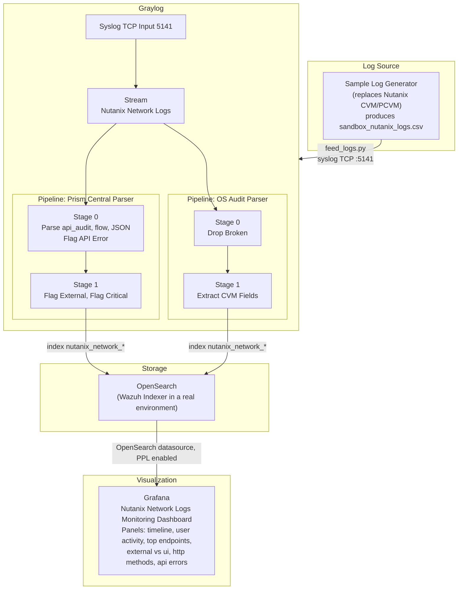

# Nutanix SOC Sandbox Architecture

## End to End Data Flow

The following diagram illustrates the journey of data from the log generator through to visualization in Grafana.



## Design Decisions

### Why Graylog Is Placed in the Middle Instead of Feeding Directly to Wazuh Manager

The primary use case is access visibility, namely answering the question of who logs in to or accesses Nutanix, rather than per event MITRE correlation. Graylog handles the ingest, normalization, and filtering process, then writes the results to OpenSearch. Grafana then reads directly from OpenSearch for visualization. This flow is lighter than forcing all data through Wazuh Manager.

### Why Two Separate Pipelines Are Used

The **Prism Central Parser** pipeline handles `api_audit`, `flow_service`, and `consolidated_audit` (JSON). The **OS Audit Parser** pipeline handles `audispd`, namely the CVM internal auditd whose log structure is entirely different because it uses keys such as `type=`, `acct=`, and `exe=`. This separation keeps the rules clean and easy to maintain.

Both pipelines connect to the same stream, namely `Nutanix Network Logs`, and run in parallel.

### Why Fields Do Not Use `.keyword`

Fields created through `set_field()` in the pipeline are stored as plain text in OpenSearch. There is no automatic mapping to a keyword subfield. Therefore, the grouping rules in Grafana are as follows.

The correct configuration uses Group By Terms on the `nutanix_client_type` field. Conversely, the incorrect configuration uses `nutanix_client_type.keyword` which is unavailable and therefore causes aggregation to fail or to produce unexpected output.

This is a common cause of pie or bar panels in Grafana appearing empty or showing only a single full slice.

## Replicated Log Formats

### api_audit (key-value)

```
<HOST> api_audit: INFO  <ts>Z clientType=External||userName=admin||
NutanixApiVersion=1.0||httpMethod=GET||restEndpoint=/v1/...||
entityUuid=||queryParams=||payload=
```

### cvm_audit (audispd)

```
<HOST> audispd[PID]: node=<node> type=USER_AUTH msg=audit(...): ...
acct="nutanix" exe="/usr/bin/su" ... res=success
```

### flow_service

```
<HOST> flow_service_logs-acropolis: <ts>Z INFO vm_idf_entity.py:NNN
PublishLearnedIp: VM <uuid> updated in IDF
```

### consolidated_audit (JSON)

```
<HOST> consolidated_audit: {"affectedEntityList":[{"entityType":"vm",
"name":"SANDBOX-VM-01","uuid":"..."}],"defaultMsg":"VM deleted",
"operationType":"Delete","recordType":"Audit","severity":"Audit",
"userName":"budi.santoso@sandbox.local"}
```
