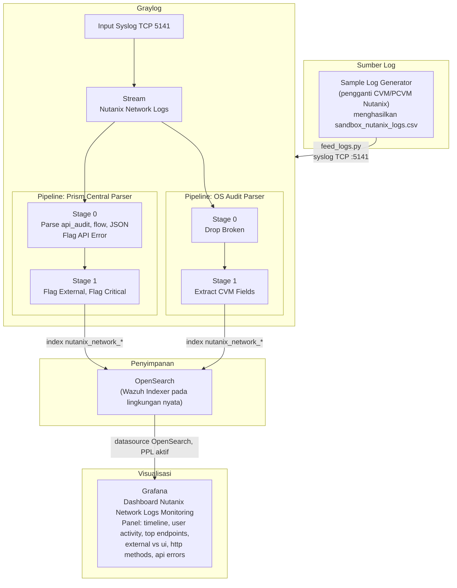

# Arsitektur Nutanix SOC Sandbox

## Alur Data Ujung ke Ujung

Diagram berikut menggambarkan perjalanan data mulai dari pembangkit log hingga tervisualisasi pada Grafana.



## Keputusan Desain

### Alasan Graylog Ditempatkan di Tengah, Bukan Langsung ke Wazuh Manager

Kasus penggunaan utama adalah visibilitas akses, yaitu menjawab pertanyaan mengenai siapa yang masuk atau mengakses Nutanix, dan bukan korelasi MITRE per peristiwa. Graylog menangani proses ingest, normalisasi, dan penyaringan, kemudian menulis hasilnya ke OpenSearch. Grafana kemudian membaca langsung dari OpenSearch untuk keperluan visualisasi. Alur ini lebih ringan dibandingkan memaksa seluruh data melewati Wazuh Manager.

### Alasan Penggunaan Dua Pipeline Terpisah

Pipeline **Prism Central Parser** menangani `api_audit`, `flow_service`, dan `consolidated_audit` (JSON). Adapun pipeline **OS Audit Parser** menangani `audispd`, yakni auditd internal CVM yang struktur lognya berbeda sama sekali karena menggunakan kunci seperti `type=`, `acct=`, dan `exe=`. Pemisahan ini menjaga aturan tetap rapi dan mudah dipelihara.

Kedua pipeline terhubung ke stream yang sama, yaitu `Nutanix Network Logs`, dan berjalan secara paralel.

### Alasan Field Tidak Menggunakan `.keyword`

Field yang dibuat melalui `set_field()` pada pipeline tersimpan sebagai teks biasa di OpenSearch. Tidak ada pemetaan otomatis menuju subfield keyword. Oleh karena itu, ketentuan pengelompokan pada Grafana adalah sebagai berikut.

Konfigurasi yang benar menggunakan Group By Terms pada field `nutanix_client_type`. Sebaliknya, konfigurasi yang keliru menggunakan `nutanix_client_type.keyword` yang tidak tersedia sehingga agregasi gagal atau menghasilkan keluaran yang tidak sesuai.

Hal ini merupakan penyebab umum panel pie atau bar pada Grafana tampak kosong atau hanya menampilkan satu irisan bernilai penuh.

## Format Log yang Direplikasi

### api_audit (key-value)

```
<HOST> api_audit: INFO  <ts>Z clientType=External||userName=admin||
NutanixApiVersion=1.0||httpMethod=GET||restEndpoint=/v1/...||
entityUuid=||queryParams=||payload=
```

### cvm_audit (audispd)

```
<HOST> audispd[PID]: node=<node> type=USER_AUTH msg=audit(...): ...
acct="nutanix" exe="/usr/bin/su" ... res=success
```

### flow_service

```
<HOST> flow_service_logs-acropolis: <ts>Z INFO vm_idf_entity.py:NNN
PublishLearnedIp: VM <uuid> updated in IDF
```

### consolidated_audit (JSON)

```
<HOST> consolidated_audit: {"affectedEntityList":[{"entityType":"vm",
"name":"SANDBOX-VM-01","uuid":"..."}],"defaultMsg":"VM deleted",
"operationType":"Delete","recordType":"Audit","severity":"Audit",
"userName":"budi.santoso@sandbox.local"}
```
